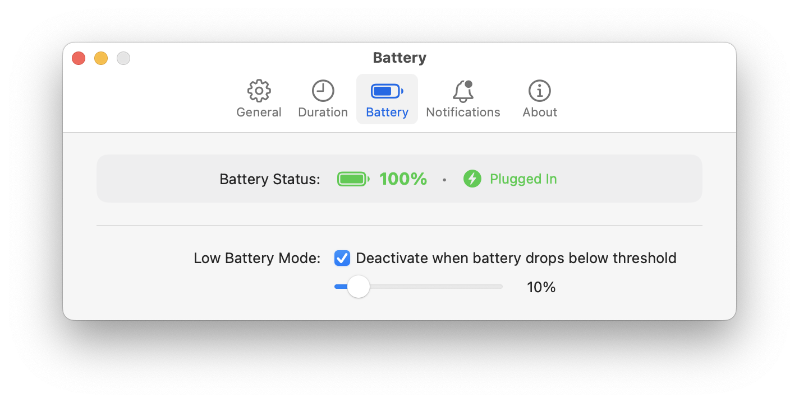
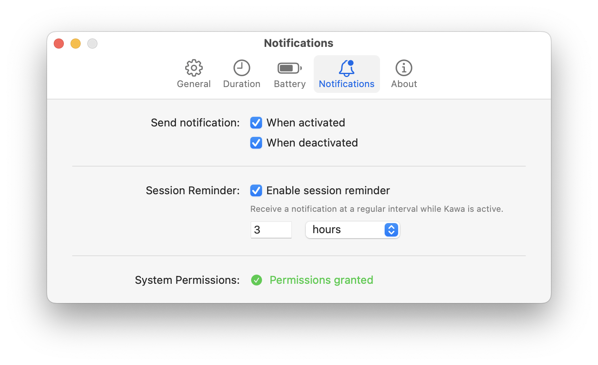

# Kawa

<p align="center">
  
   <!-- <br>
   <strong>Status: </strong>In development<br>
   <br>
   <a href="https://github.com/christianfrey/kawa/releases"><strong>Download</strong></a>
    · 
   <a-- href="https://github.com/christianfrey/kawa/commits">Commits</a-->
</p>
</br>

Kawa is a small macOS menu bar app that keeps your Mac awake using system power management.

## Features

- **Prevent Sleep:** Keep the system awake for a preset duration or indefinitely.
- **Menu Bar Control:** Toggle sleep prevention from the menu bar (left-click for menu, right-click to toggle instantly).
- **Custom Durations:** Choose a default duration or set a custom time per session.
- **Clamshell Mode:** Prevent system sleep when the lid is closed (works like Amphetamine).
- **Display Sleep Option:** Allow the display to sleep while keeping the machine awake.
- **Battery Safety:** Automatically disable when battery is low; configurable threshold.
- **Launch at Login:** Option to start Kawa on login.
- **Notifications:** Optional user notifications when sessions start/stop.
- **Lightweight:** Native SwiftUI app with a small footprint.

## Settings

### General


Manage general app behavior, including launching at login, starting a session automatically at launch, ending session on manual system sleep, resuming session after system wake, allowing display sleep, menu bar icon click actions, and Clamshell Mode (keep Mac awake when lid is closed).

### Duration


Set default session duration or pick a custom one.

### Battery



Configure battery safety: automatically disable sessions below a certain battery level.

### Notifications



Enable or disable notifications, set a session reminder and manage macOS notification access.

## Installation

1. Clone the repository:

```bash
git clone https://github.com/christianfrey/kawa.git
```

2. Open `Kawa.xcodeproj` in Xcode.
3. Build and run the app.

## License

This project is licensed under the MIT License.
